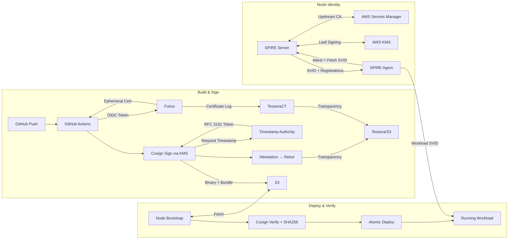
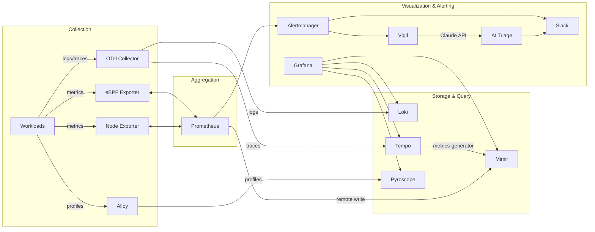
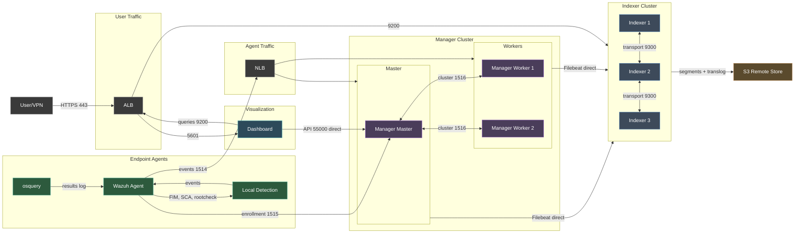

# deploy-bootstrap

Ansible roles for infrastructure configuration management, security hardening and app deployment.

## Overview

Each role is self-contained with its own defaults and templates. Infrastructure-specific configuration (endpoints, ARNs, resource IDs) is pulled from AWS SSM Parameter Store at runtime, set by CloudFormation stacks. Application-level config (versions, ports, TTLs, tuning) lives in role defaults.

Roles generally pull in `vars/default.yml` and `vars/<OS family>.yml` for OS-specific configuration.

## Usage
```
ansible-playbook -i localhost, -e var=value -c local playbook.yml
```
### Requirements
```
ansible-galaxy collection install -r requirements.yml
```
These are not meant to be reference implementations, these are what I actually use to configure, deploy, and manage services across ~200 nodes in production. A lot of this is tightly integrated with the rest of my infrastructure (SSM parameters set in CloudFormation, cross-account KMS signing, OIDC federation). Those repos should be public soon.

These were mostly written for Ubuntu. The core roles support any Debian, Amazon Linux, or RHEL family system, but many application roles are only configured for Ubuntu. That's typically a few-line change per role (package name, config path, firewalld instead of ufw rules).

## Notes

These are run locally on the node being configured as part of either golden image creation or initial bootstrapping of a production instance.

They are idempotent, but not designed for repeated runs as part of ongoing updates as the intended use-case (would cache downloads, parameterize more vars, separate tasks into install/configure, etc).

All nodes are designed for ephemeral local storage. State is stored in RDS, S3, SecretsManager, SSM, etc - no role depends on local disk persistence.

## Architecture

### Supply Chain & Trust



Binaries are built in GitHub Actions using my [build system](https://github.com/keithlinneman/build-system), signed with Cosign via KMS, timestamped via timestamp-authority, and logged to Rekor and TesseraCT for transparency. Nodes fetch artifacts from S3 and verify signatures and checksums before deploying. SPIRE provides runtime workload identity via SPIFFE SVIDs backed by a KMS upstream certificate authority signed by a YubiKey-backed root CA.

### Observability & Alerting



Metrics are scraped by per-account Prometheus instances and remote-written to Mimir for long-term storage. Logs and traces flow through OTel Collector to Loki and Tempo. Alloy handles continuous profiling to Pyroscope and also forwards instrumented application profiles. Tempo generates RED metrics from traces back to Mimir. Alerts route through Alertmanager to both Slack and [Vigil](https://github.com/linnemanlabs/vigil), which uses the Claude API to query Prometheus, Loki, and AWS at alert time and post AI-assisted triage to Slack.

### Security Monitoring



Wazuh provides host intrusion detection, file integrity monitoring, vulnerability detection, and CIS compliance scanning across all nodes. Agents report to a clustered manager which ships alerts via Filebeat to an S3-backed OpenSearch indexer cluster. osquery provides deep endpoint visibility with BPF process tracing, listening port snapshots, and system inventory. All component TLS is backed by KMS-signed certificates chained to a YubiKey root CA.

## Roles

### System
- `common` - Base OS setup, package management, timezone, swap, services, MOTD
- `common-security` - CIS benchmark hardening (SSH, PAM, auditd, AIDE, sysctl, kernel modules, cron, firewall, password policy, AppArmor)
- `bastion` - Bastion/jump host configuration

### Observability
- `prometheus` - Prometheus server, blackbox exporter, scrape configs, recording and alerting rules
- `prometheus-monitored-instance` - Node exporter and eBPF exporter for monitored instances
- `mimir` - Grafana Mimir long-term metrics storage
- `loki` - Grafana Loki log aggregation
- `tempo` - Grafana Tempo distributed tracing
- `pyroscope` - Grafana Pyroscope continuous profiling
- `grafana` - Grafana visualization and dashboards
- `alertmanager` - Prometheus Alertmanager with cluster peering
- `alloy` - Grafana Alloy telemetry collector
- `otel-collector` - OpenTelemetry Collector with journald, syslog, and OTLP pipelines
- `vigil` - AI-Powered alert analysis and triage. [Vigil sourcecode on GitHub](https://github.com/linnemanlabs/vigil)

### Trust & Transparency
- `spire-server` - SPIFFE/SPIRE server with KMS-backed leaf signing and PostgreSQL datastore
- `spire-agent` - SPIRE agent with workload attestation
- `fulcio` - Sigstore Fulcio certificate authority for keyless code signing
- `rekor-tiles` - Sigstore Rekor transparency log (v2/Tessera backend)
- `tesseract` - TesseraCT certificate transparency log
- `timestamp-authority` - Sigstore Timestamp Authority (RFC 3161)

### Security
- `wazuh-indexer` - Wazuh indexer cluster (OpenSearch) with S3 remote-backed storage, KMS-signed component certificates
- `wazuh-manager` - Wazuh manager cluster with Filebeat alert shipping, clustered master/worker topology
- `wazuh-dashboard` - Wazuh dashboard (OpenSearch Dashboards) with Wazuh plugin
- `wazuh-agent` - Wazuh agent for endpoint monitoring, file integrity, SCA, vulnerability detection
- `osquery` - osquery endpoint visibility with BPF process monitoring, scheduled queries, and Wazuh integration

### Infrastructure
- `memcached` - Memcached with Prometheus exporter
- `vpn-wireguard` - WireGuard VPN server with route forwarding

### Applications
- `linnemanlabs-web-server` - LinnemanLabs webserver deployment with Cosign verification
- `linnemanlabs-trust-portal` - LinnemanLabs trust portal deployment with Cosign verification

## License

MIT. Copy it, steal it, modify it, learn from it, share your improvements with me. Or don't. It's code, do what you want with it.